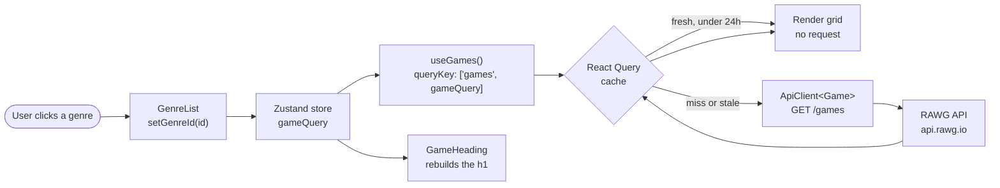
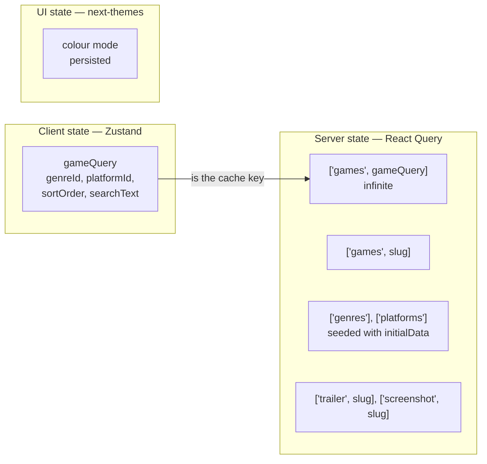

# Game Hub

**A game discovery app: browse, filter, sort and search thousands of games, then open any one of them for the full details, trailer and screenshots.**

Games come from the [RAWG](https://rawg.io/apidocs) database. The home page combines four independent
filters: genre, platform, sort order and text search. Clicking a card opens its detail page with description, platforms,
publishers, Metascore, trailer and screenshots.

Frontend-only React 19 + TypeScript SPA, built with Vite and Chakra UI v3. Light and dark mode.

---

## Live demo

|                 |                                          |
| --------------- | ---------------------------------------- |
| **Web app**     | https://game-hub-livid-alpha.vercel.app/ |
| **Data source** | https://rawg.io/apidocs                  |

> **Note.** The app talks to the public RAWG API directly from the browser, so there is no backend
> to wake up. Everything you see is fetched live and cached in the browser for 24 hours.

---

## Screenshots

<details>
<summary>Click to expand</summary>

**Home page** — sorting, filtering, searching, ordering


**Game detail page** — name, description, attributes, trailer and screenshots


</details>

---

## Features

| Feature               | What it does                                                                                           |
| --------------------- | ------------------------------------------------------------------------------------------------------ |
| **Genre filter**      | Sidebar list of genres, each with its own artwork. The selected genre is bolded                        |
| **Platform filter**   | Dropdown of parent platforms (PC, PlayStation, Xbox, …)                                                |
| **Sort order**        | Relevance, date added, name, release date, Metacritic or rating                                        |
| **Search**            | Free-text search from the navbar, which also returns you to the home page from anywhere                |
| **Infinite scroll**   | Pages load as you scroll, with a spinner while fetching and an end message when the list runs out      |
| **Dynamic heading**   | The `<h1>` rebuilds itself from the active filters, e.g. _PlayStation Action Games_                    |
| **Game detail page**  | Expandable description, platforms, genres, publishers, Metascore, embedded trailer and screenshot grid |
| **Critic score**      | Metascore badge, colour-coded green above 75, yellow above 60, red below                               |
| **Rating emoji**      | Games rated 3, 4 or 5 get a 😐 / 👍 / 🎯 emoji next to the title                                       |
| **Light / dark mode** | Toggle in the navbar, persisted across reloads                                                         |
| **Skeleton loaders**  | The grid renders placeholder cards while the first page is in flight, so the layout never jumps        |

---

## How the data layer works

### One store drives every query

All four filters live in a single Zustand store as one `GameQuery` object:

```ts
interface GameQuery {
  genreId?: number;
  platformId?: number;
  sortOrder?: string;
  searchText?: string;
}
```

That object is the React Query cache key:

```ts
queryKey: ['games', gameQuery];
```

So changing any filter produces a new key, which React Query treats as a different query and fetches
automatically.

`placeholderData: keepPreviousData` keeps the old grid on screen while the new one loads, so the page
does not collapse to a spinner on every filter click.

Components never talk to each other about filters either. `SearchInput` calls `setSearchText`,
`GenreList` calls `setGenreId`, and `GameHeading` and `GameGridInfiniteScroll` read what they need
straight from the store. Nothing is passed down through props.

### Caching

Every query uses `staleTime: ms('24h')`, so a day old cached response is still correct. The genre and platform lists use `initialData`:

```ts
useQuery({ queryKey: ['genres'], queryFn: …, staleTime: ms('24h'), initialData: genres })
```

### Infinite scroll

`useInfiniteQuery` asks RAWG for one page at a time. RAWG returns a `next` URL when more results
exist, which is all the hook needs to decide whether to keep going:

```ts
getNextPageParam: (lastPage, allPages) =>
  lastPage.next ? allPages.length + 1 : undefined;
```

### A single generic API client

Rather than one fetch function per endpoint, there is one class parameterised by the entity it
returns:

```ts
const apiClient = new ApiClient<Game>('/games');

apiClient.getAll({
  params: { genres, parent_platforms, ordering, search, page },
});
apiClient.get(slug);
```

### Smaller images for free

RAWG serves full-size artwork, which is wasteful for a 600×400 card. `getCroppedImageUrl` splices a
crop directive into the media path:

```
https://media.rawg.io/media/games/abc.jpg
→ https://media.rawg.io/media/crop/600/400/games/abc.jpg
```

It also falls back to a bundled placeholder when a game has no artwork, so the grid never shows a
broken image.

---

## Architecture

### How a filter click becomes a rendered grid



### Where state lives



Client state (what the user chose) is held by Zustand, while everything that came from the network
(server state) is owned, cached and invalidated by React Query.

---

## Tech stack

|                 |                                                                            |
| --------------- | -------------------------------------------------------------------------- |
| Framework       | React 19, TypeScript 6                                                     |
| Build           | Vite 8, with an `@/*` path alias to `src/*`                                |
| Server state    | TanStack Query 5 — `useQuery`, `useInfiniteQuery`, Devtools                |
| Client state    | Zustand 5                                                                  |
| Routing         | React Router 7, data router with a route-level error element               |
| UI              | Chakra UI 3, Emotion, `react-icons`                                        |
| Colour mode     | `next-themes`, plus a custom Chakra semantic token for the dark background |
| HTTP            | Axios, wrapped in one generic `ApiClient<T>`                               |
| Infinite scroll | `react-infinite-scroll-component`                                          |
| Linting         | ESLint 10, `typescript-eslint`, `eslint-plugin-react-hooks`                |
| Deployment      | Vercel                                                                     |

---

## Project structure

Organised by role: entities describe the API's shapes, hooks own the data fetching, components stay
presentational.

```
src/
├── main.tsx              providers: Chakra, React Query, router
├── store.ts              Zustand GameQuery store — the single source of filter state
├── routing/
│   └── routes.tsx        / and /games/:slug, with an error element
├── pages/
│   ├── Layout.tsx        navbar + <Outlet />
│   ├── HomePage.tsx      responsive grid: genre aside + main column
│   └── ErrorPage.tsx     404 and unexpected errors
├── entities/             Game, Genre, Platform, Publisher, Screenshot, Trailer
├── services/
│   ├── api-client.ts     generic ApiClient<T>, Axios base URL and API key
│   └── image-url.ts      RAWG crop URL rewriting + placeholder fallback
├── hooks/                useGames, useGame, useGenres, useGenre,
│                         usePlatforms, usePlatform, useTrailers, useScreenshots
├── components/
│   ├── data/             hard-coded genre and platform snapshots used as initialData
│   ├── ui/               Chakra provider, colour mode, toaster, tooltip
│   └── …                 NavBar, GameCard, GenreList, SortSelector, GameDetailPage, …
└── assets/               logo, rating emoji, no-image placeholder
```

`hooks/useGenre.ts` and `hooks/usePlatform.ts` deserve a note: the singular hooks do not fetch
anything. They read the already-cached list and find one item by id, which is how `GameHeading` can
name the current filter without a second request.

---

## Running locally

**Prerequisites:** Node.js 22 or newer, and a free RAWG API key from https://rawg.io/apidocs.

```bash
git clone https://github.com/kkatalz/game-hub.git
cd game-hub
npm ci
echo "VITE_RAWG_KEY=your_key_here" > .env
npm run dev                   # http://localhost:5173
```

Other scripts:

```bash
npm run build     # tsc -b, then vite build
npm run preview   # serve the production build locally
npm run lint      # eslint
```

### Environment variables

| Variable        | Used for                                                      |
| --------------- | ------------------------------------------------------------- |
| `VITE_RAWG_KEY` | RAWG API key, attached to every request by the Axios instance |

---

## About

Built while learning React, working through the data-fetching side of a modern SPA: caching,
infinite queries, keeping server state and client state apart, and typing an external API end to
end.

Game data by [RAWG](https://rawg.io).

Written by [Zlata Karbovska](https://github.com/kkatalz).
